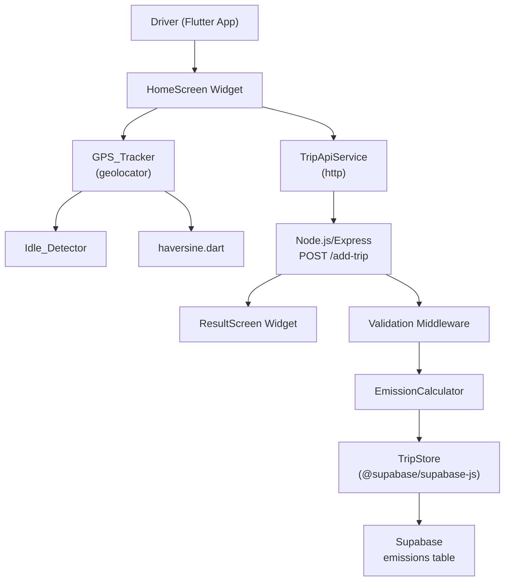

# Design Document: CarbonChain Carbon Tracking System

## Overview

CarbonChain is a mobile application for tracking carbon emissions across delivery trips. The system has three layers:

- **Flutter mobile app** — runs on the driver's device, handles GPS tracking, UI, and trip submission
- **Node.js/Express backend** — receives trip data, calculates carbon emissions, persists records
- **Supabase (PostgreSQL)** — stores trip emission records for historical reporting

The app tracks GPS location at 5-second intervals, computes incremental distance using the Haversine formula, detects idle time from sub-5m GPS updates, and submits trip data to the backend on stop. The backend validates input, applies the emission formula, stores the result, and returns the carbon value to the app.

---

## Architecture



**Data flow for a trip:**
1. Driver fills in fuel type and load weight, presses Start Trip
2. GPS_Tracker polls location every 5 seconds; Haversine computes incremental distance
3. Updates < 5 m are discarded from distance and added to idle counter; updates >= 5 m accumulate distance
4. Driver presses Stop Trip; app POSTs `{distance, fuel_type, idle_time, load_weight}` to `/add-trip`
5. Backend validates, calculates `carbon_kg`, inserts record into Supabase, returns `{"carbon": value}`
6. App navigates to Result Screen showing distance, idle time, and carbon

---

## Components and Interfaces

### Flutter App

**GpsTracker** (`app/lib/services/gps_tracker.dart`)
```dart
class GpsTracker {
  void startTracking();          // begins 5-second polling, resets state
  void stopTracking();           // cancels timer
  LatLng? previousLocation;
  LatLng? currentLocation;
  double cumulativeDistanceM;    // metres
  int idleTimeSeconds;
}
```

**haversine** (`app/lib/utils/haversine.dart`)
```dart
double haversine(LatLng a, LatLng b); // returns distance in metres
```

**TripApiService** (`app/lib/services/trip_api_service.dart`)
```dart
class TripApiService {
  Future<double> submitTrip({
    required double distance,
    required String fuelType,
    required int idleTime,
    required double loadWeight,
  }); // throws TimeoutException after 15s, throws on non-2xx
}
```

**HomeScreen** (`app/lib/screens/home_screen.dart`)
- Fuel type dropdown, load weight field, status label, distance/idle display, Start/Stop buttons

**ResultScreen** (`app/lib/screens/result_screen.dart`)
- Displays distance (km), idle time (min), carbon (kg CO₂), "New Trip" button

---

### Node.js Backend

**Validation Middleware** (`backend/src/middleware/validate.ts`)
- Checks presence of `distance`, `fuel_type`, `idle_time`, `load_weight`
- Validates `fuel_type` ∈ {"diesel", "petrol"}
- Validates `distance` and `idle_time` are numeric
- Returns HTTP 400 with descriptive message on failure

**EmissionCalculator** (`backend/src/emissionCalculator.ts`)
```typescript
function calculateCarbon(
  distance: number,
  fuelType: "diesel" | "petrol",
  idleTime: number
): number;
// carbon_kg = distance * emissionFactor + idleTime * 0.5
// diesel: emissionFactor = 2.6, petrol: emissionFactor = 2.3
```

**TripStore** (`backend/src/tripStore.ts`)
```typescript
async function insertTrip(record: {
  distance: number;
  idle_time: number;
  fuel_type: string;
  carbon_kg: number;
}): Promise<void>;
// auto-generates UUID id and UTC created_at
// logs error on failure, does not throw
```

**Route** (`backend/src/routes/addTrip.ts`)
- `POST /add-trip` → validate → calculateCarbon → insertTrip → `{"carbon": value}`

---

## Data Models

### HTTP Request — POST /add-trip

```json
{
  "distance": 12.4,
  "fuel_type": "diesel",
  "idle_time": 3.5,
  "load_weight": 500
}
```

| Field | Type | Constraints |
|---|---|---|
| distance | number | >= 0 |
| fuel_type | string | "diesel" or "petrol" |
| idle_time | number | >= 0, in minutes |
| load_weight | number | >= 0, in kg |

### HTTP Response — 200 OK

```json
{ "carbon": 34.95 }
```

### HTTP Response — 400 Bad Request

```json
{ "error": "Missing required field: fuel_type" }
```

### Supabase `emissions` Table

| Column | Type | Notes |
|---|---|---|
| id | UUID | Primary key, auto-generated |
| distance | FLOAT | km |
| idle_time | FLOAT | minutes |
| fuel_type | TEXT | "diesel" or "petrol" |
| carbon_kg | FLOAT | calculated value |
| created_at | TIMESTAMPTZ | DEFAULT now(), UTC |

### Flutter In-Memory Trip State

```dart
class TripState {
  bool isActive;
  double cumulativeDistanceM;  // metres, displayed as km
  int idleTimeSeconds;         // displayed as whole minutes
  String? fuelType;
  double? loadWeightKg;
}
```

---

## Correctness Properties

*A property is a characteristic or behavior that should hold true across all valid executions of a system — essentially, a formal statement about what the system should do. Properties serve as the bridge between human-readable specifications and machine-verifiable correctness guarantees.*

### Property 1: Emission formula correctness

*For any* valid distance (>= 0), fuel type ("diesel" or "petrol"), and idle time (>= 0), the calculated carbon value must equal `distance * emissionFactor + idleTime * 0.5`, where emissionFactor is 2.6 for diesel and 2.3 for petrol.

**Validates: Requirements 6.1, 6.2, 6.3**

---

### Property 2: Diesel always produces more carbon than petrol

*For any* distance > 0 and idle time >= 0, the carbon calculated with fuel type "diesel" must be strictly greater than the carbon calculated with fuel type "petrol" for the same inputs.

**Validates: Requirements 6.2, 6.3**

---

### Property 3: Backend input validation returns 400

*For any* request body that is missing a required field (`distance`, `fuel_type`, `idle_time`, `load_weight`), contains an invalid `fuel_type`, or contains non-numeric `distance` or `idle_time`, the backend must return HTTP 400 with a non-empty error message.

**Validates: Requirements 6.4, 6.5, 6.6**

---

### Property 4: Valid request returns 200 with carbon value

*For any* valid request body (all fields present, valid fuel type, numeric distance and idle_time), the backend must return HTTP 200 with a JSON body containing a numeric `carbon` field equal to the formula result.

**Validates: Requirements 6.7**

---

### Property 5: Haversine symmetry

*For any* two GPS coordinates A and B, `haversine(A, B)` must equal `haversine(B, A)`.

**Validates: Requirements 2.1**

---

### Property 6: Haversine identity

*For any* GPS coordinate A, `haversine(A, A)` must equal 0.

**Validates: Requirements 2.1**

---

### Property 7: Distance threshold and idle accumulation

*For any* sequence of GPS updates, updates where the incremental distance is less than 5 metres must not increase the cumulative distance but must increase the idle counter by 5 seconds; updates where the incremental distance is 5 metres or greater must increase the cumulative distance by that amount and must not increase the idle counter.

**Validates: Requirements 2.2, 2.3, 3.1, 3.2**

---

### Property 8: Reset on start

*For any* prior trip state (non-zero distance, non-zero idle time), calling `startTracking()` must reset cumulative distance to zero and idle time to zero.

**Validates: Requirements 2.5, 3.4**

---

### Property 9: Trip record invariants

*For any* successfully inserted trip record, the `id` field must be a valid UUID and the `created_at` field must be a valid UTC timestamp.

**Validates: Requirements 7.2, 7.3**

---

### Property 10: Trip status UI reflects active state

*For any* trip state (active or inactive), the status label must display "Running" when active and "Stopped" when inactive; the "Start Trip" button must be disabled when active; the "Stop Trip" button must be disabled when inactive; the fuel type and load weight inputs must be disabled when active.

**Validates: Requirements 4.5, 9.1, 9.2, 9.3, 9.4**

---

### Property 11: Result screen displays all trip data

*For any* trip result (distance, idle time, carbon value), the Result Screen must display all three values and provide a "New Trip" button that resets all trip state to initial values.

**Validates: Requirements 8.1, 8.2, 8.3, 8.4, 8.5**

---

## Error Handling

| Scenario | Handling |
|---|---|
| Location permission denied | Show error dialog: "GPS access is required to track trips"; block trip start |
| GPS signal lost during trip | Retain last known location; continue polling |
| Missing/invalid request fields | Return HTTP 400 with descriptive error message |
| Database insert failure | Log error; still return calculated carbon to app |
| Backend returns error response | App shows error message; stays on Home Screen |
| Network timeout (15 s) | App shows timeout error; allows retry |
| Non-numeric distance/idle_time | Return HTTP 400 |

---

## Testing Strategy

### Dual Testing Approach

Both unit/widget tests and property-based tests are required. They are complementary:
- Unit/widget tests cover specific examples, integration points, and error conditions
- Property-based tests verify universal correctness across all inputs

### Backend (Node.js/TypeScript)

**Property-based testing library**: [fast-check](https://github.com/dubzzz/fast-check)

Each property test must run a minimum of 100 iterations.

Tag format: `// Feature: carbon-chain, Property N: <property_text>`

| Property | Test description |
|---|---|
| Property 1 | Generate random (distance, fuelType, idleTime) and verify formula result |
| Property 2 | Generate random (distance > 0, idleTime) and verify diesel > petrol |
| Property 3 | Generate requests with missing/invalid fields and verify HTTP 400 |
| Property 4 | Generate valid requests and verify HTTP 200 with correct carbon value |
| Property 9 | Insert a trip record and verify id is UUID and created_at is UTC timestamp |

Unit tests:
- Each missing-field combination returns 400
- Invalid fuel_type returns 400
- Non-numeric distance/idle_time returns 400
- DB failure still returns carbon value (mock Supabase)
- Happy path returns correct carbon value

### Flutter App (Dart)

**Property-based testing library**: [dart_test](https://pub.dev/packages/test) with [glados](https://pub.dev/packages/glados) for property-based testing

Each property test must run a minimum of 100 iterations.

Tag format: `// Feature: carbon-chain, Property N: <property_text>`

| Property | Test description |
|---|---|
| Property 5 | Generate random coordinate pairs and verify haversine(A,B) == haversine(B,A) |
| Property 6 | Generate random coordinates and verify haversine(A,A) == 0 |
| Property 7 | Generate sequences of GPS updates and verify distance/idle accumulation rules |
| Property 8 | Set arbitrary trip state, call startTracking(), verify reset to zero |
| Property 10 | Render HomeScreen in active/inactive states and verify UI element states |
| Property 11 | Render ResultScreen with random trip data and verify all values displayed |

Widget/unit tests:
- Validation errors shown when fuel type or load weight missing on start
- Loading indicator shown and Stop Trip disabled during submission
- On success, navigates to ResultScreen with correct values
- On error response, stays on HomeScreen with error message
- On timeout, shows timeout error and allows retry
- "New Trip" button resets all state
- GPS unavailability retains last known location (edge case)
- Network timeout after 15 seconds (edge case)
